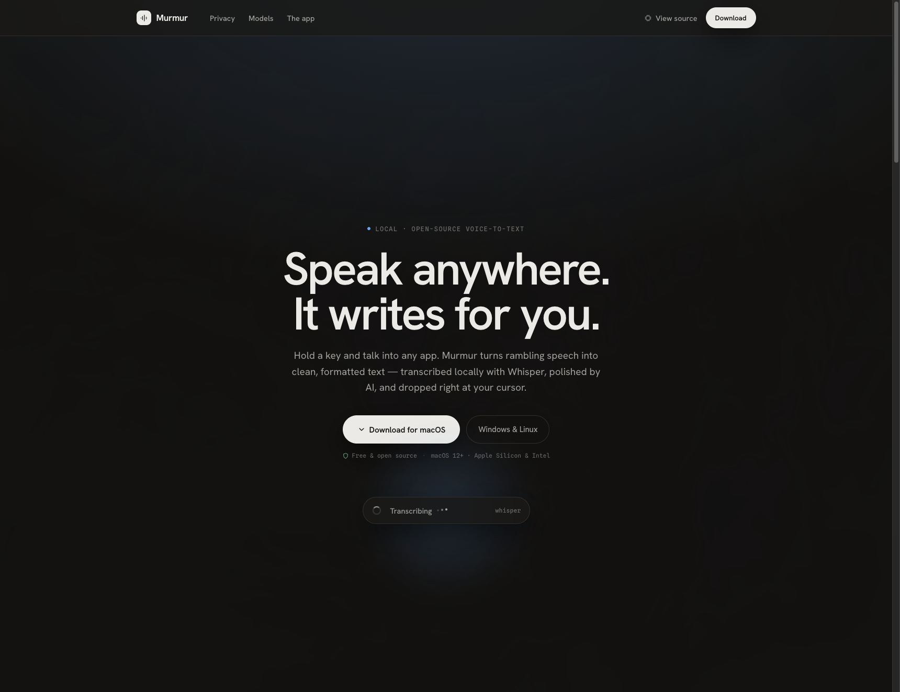
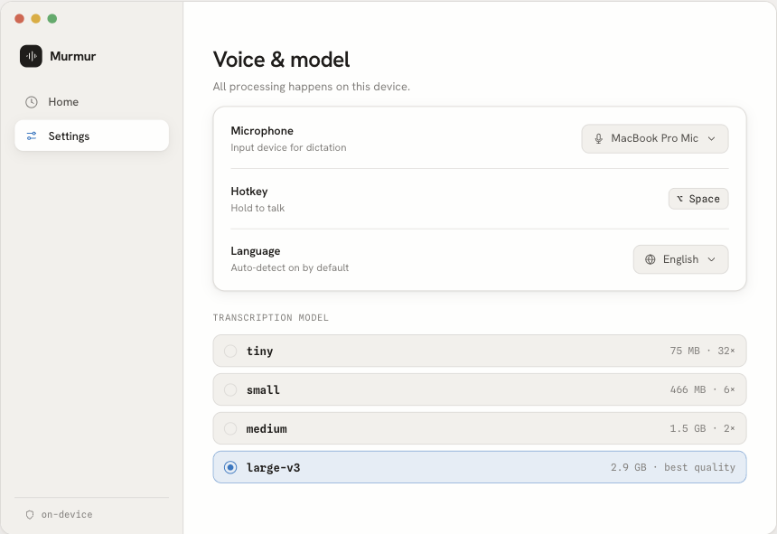

<div align="center">



# Murmur

**Local, on-device voice-to-text for the desktop.**

Hold a key, talk into any app, and get clean, formatted text dropped right at your cursor —
transcribed locally with [Whisper](https://github.com/openai/whisper), polished by AI, and **never uploaded**.

<br>

[](https://github.com/kurenn/murmur/actions/workflows/ci.yml)
[](https://github.com/kurenn/murmur/releases)
[](LICENSE)
[](#-install)
[](#-privacy-by-architecture)

[](https://tauri.app)
[](https://www.rust-lang.org)
[](https://react.dev)
[](#-whisper-models)

**[⬇️ Download](https://github.com/kurenn/murmur/releases)** · **[🌐 Website](https://kurenn.github.io/murmur/)** · **[🐛 Issues](https://github.com/kurenn/murmur/issues)**

</div>

---

## ✨ What it does

Murmur is a tiny menu-bar app that turns speech into text anywhere you can type.

- 🎙️ **Hold-to-talk, anywhere** — press and hold **⌥ Space** in any app, speak, release. The text appears at your cursor.
- 🧠 **Transcribed locally with Whisper** — runs on your CPU or GPU (Metal on macOS). No audio ever leaves your machine.
- ✨ **Polished by AI** — a cleanup pass strips filler words, fixes punctuation and capitalization, and formats the result.
- 🔒 **Private by design** — no account, no sync, no telemetry, no cloud. Download, grant mic access, and talk.
- 🗂️ **A real desktop app** — searchable history, words-saved stats and a streak, every setting on one screen.
- 🪶 **Light & native** — a Tauri app (Rust + system webview), ~7 MB installer, with a frosted floating overlay.
- 🌍 **Multilingual** — English, Spanish, French, German, Japanese, Chinese, with auto-detect.
- 🖥️ **Optional remote server** — offload transcription to a beefier machine over an OpenAI-compatible endpoint.

## 🎬 How it works

```
   you speak              whisper                ai polish              inserted
   ─────────  ───▶  ──────────────────  ───▶  ───────────────  ───▶  ────────────
   hold ⌥ Space      transcribe on-device      filler & grammar      at your cursor
                                                                    ┊
                          ✗ the cloud — never touched ┄┄┄┄┄┄┄┄┄┄┄┄┄┄┘
```

Audio is captured, resampled to 16 kHz mono, transcribed by Whisper **in memory**, cleaned up, then
written to the focused field via the clipboard + a synthetic paste. Nothing is written to disk or sent anywhere.

## 🖥️ The desktop app

<table>
  <tr>
    <td width="50%"></td>
    <td width="50%"></td>
  </tr>
  <tr>
    <td align="center"><b>Home</b> — every dictation, searchable, with stats and your streak.</td>
    <td align="center"><b>Voice &amp; model</b> — mic, hotkey, language and the Whisper picker.</td>
  </tr>
</table>

## 🧠 Whisper models

Murmur ships every OpenAI Whisper size — pick the one that fits your machine. Smaller is faster, larger is
sharper, and they all run **entirely on-device**. Models download on first use and you can switch any time.

| Model      | Download | Speed        | Accuracy | Best for                   |
| ---------- | -------- | ------------ | -------- | -------------------------- |
| `tiny`     | 75 MB    | 32× realtime | ●●○○○    | Quick notes                |
| `base`     | 142 MB   | 16× realtime | ●●●○○    | Everyday chat              |
| `small`    | 466 MB   | 6× realtime  | ●●●○○    | Balanced                   |
| `medium`   | 1.5 GB   | 2× realtime  | ●●●●○    | High accuracy              |
| `large-v3` | 2.9 GB   | 1× realtime  | ●●●●●    | Best quality · **default** |

## 🔒 Privacy by architecture

Most dictation tools stream your microphone to someone else's servers. Murmur doesn't. Both transcription
and the AI cleanup pass run on the one machine you control:

- **Processed on-device** — audio is transcribed in memory and discarded; never written to disk, never sent anywhere.
- **No account, no cloud** — no sign-up, no sync, no telemetry, no background phone-home.
- **Open source, forever** — every line is auditable here. MIT-licensed and free.

## ⬇️ Install

Grab the latest installer from the **[Releases page](https://github.com/kurenn/murmur/releases)**.

| OS          | File                  | Notes                                                                             |
| ----------- | --------------------- | --------------------------------------------------------------------------------- |
| **macOS**   | `.dmg` (universal)    | Apple Silicon + Intel. Unsigned for now → **right-click → Open** on first launch. |
| **Windows** | `.msi` or `.exe`      | Requires WebView2 (preinstalled on Windows 10/11).                                |
| **Linux**   | `.AppImage` or `.deb` | AppImage: `chmod +x Murmur*.AppImage && ./Murmur*.AppImage`.                       |

On first launch, grant **Microphone** access (and **Accessibility** on macOS, so Murmur can paste into other apps).

## 🔨 Build from source

**Prerequisites:** [Rust](https://www.rust-lang.org/tools/install) (stable), [Node.js](https://nodejs.org) 18+,
and the [Tauri v2 system dependencies](https://v2.tauri.app/start/prerequisites/) for your OS.

```bash
git clone https://github.com/kurenn/murmur.git
cd murmur
npm install            # installs deps + the git pre-commit hook

npm run tauri dev      # run the app with hot-reload
npm run tauri build    # produce a native installer in src-tauri/target/release/bundle
```

## 🌐 Remote Whisper server (optional)

Run transcription on another machine (e.g. a desktop with a GPU) and point the app at it from
**Settings → Remote server**. The bundled server exposes an OpenAI-compatible
`/v1/audio/transcriptions` endpoint:

```bash
cd server
./install.sh          # creates a venv + installs the Whisper server (use Python 3.12)
./run.sh              # serves on http://0.0.0.0:8000
```

See [`server/README.md`](server/README.md) for details.

## 🧪 Development & testing

```bash
npm test                       # frontend specs (Vitest + Testing Library)
cd src-tauri && cargo test     # backend specs (pure logic: polish, resample, config, …)
```

A **pre-commit hook** (installed by `npm install`) runs `tsc` + Vitest on frontend changes and
`cargo test` on backend changes; CI ([`ci.yml`](.github/workflows/ci.yml)) re-runs everything on macOS.
Releases are built on native macOS / Windows / Linux runners by [`release.yml`](.github/workflows/release.yml).

## 🗂️ Project structure

```
murmur/
├── src/                  # React + TypeScript UI (dashboard, overlay, onboarding, design system)
├── src-tauri/            # Rust backend
│   └── src/
│       ├── lib.rs        # app wiring, tray, hotkey, commands, window setup
│       ├── audio.rs      # microphone capture (cpal)
│       ├── transcribe.rs # Whisper (local) + remote transcription, WAV/resample
│       ├── polish.rs     # AI/heuristic text cleanup
│       ├── inject.rs     # clipboard + synthetic paste (accessibility-gated)
│       └── …             # config, history, state
├── server/               # optional remote Whisper server (Python)
└── docs/                 # the marketing site (GitHub Pages → kurenn.github.io/murmur)
```

## 📄 License

[MIT](LICENSE) © Abraham Kuri Vargas. Free and open source — no trial, no seat count, no paywall.

<div align="center"><sub>Built with <a href="https://tauri.app">Tauri</a>, <a href="https://www.rust-lang.org">Rust</a> and <a href="https://react.dev">React</a> · transcribed by <a href="https://github.com/openai/whisper">Whisper</a>, polished by AI, never uploaded.</sub></div>
